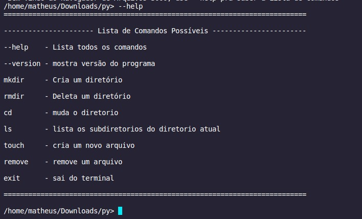
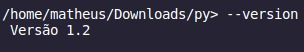
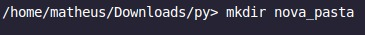
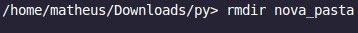
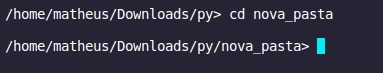
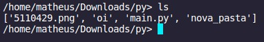
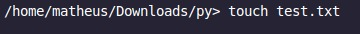
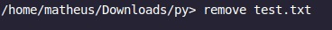
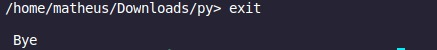

# Navegador-de-Arquivos-3000


Neste Trabalho tentei fazer um programa que se assemelhasse o máximo o possível com um navegador de arquivos padrão do Linux que eu utilizei de exemplo, neste READ.ME vou listar as suas funções e como usá-las:

## :hammer: Funcionalidades do projeto

### `--help`    : Lista todos os comandos que poderam ser utilizados no programa
```
Este comando não precisa de nenhuma Flag ou acompanhamento para funcionar, basta apenas rodar um "--help" no seu programa,
como segue o exemplo:
```
<p align='center'>
  
</p>

### `--version` : Mostra versão atual do programa
```
Este comando não precisa de nenhuma Flag ou acompanhamento para funcionar, basta apenas rodar um "--version" no seu programa,
como segue o exemplo:
```
<p align='center'>
  
</p>

### `mkdir`     : Cria um novo diretório
```
Para que este comando funcione precisa vir seguido do nome do diretório que deseja criar,
como segue o exemplo:
```
<p align='center'>
  
</p>

### `rmdir`     : Remove um diretório
```
Para que este comando funcione precisa vir seguido do nome do diretório que deseja remover,
como segue o exemplo:
```
<p align='center'>
  
</p>

### `cd`        : Altera o seu diretória atual
```
Para que este comando funcione precisa vir seguido do caminho para o diretório que você deseja se mover,
como segue o exemplo:
```
<p align='center'>
  
</p>

### `ls`        : Informa todos os arquivos dentro do diretório atual
```
Este comando não precisa de nenhuma Flag ou acompanhamento para funcionar, basta apenas rodar um "ls" no seu programa,
como segue o exemplo:
```
<p align='center'>
  
</p>

### `touch`     : Cria um novo arquivo
```
Para que este comando funcione precisa vir seguido do nome do arquivo que deseja criar, já mostrando a extensão do arquivo
como segue o exemplo:
```
<p align='center'>
  
</p>

### `remove`    : Remove um arquivo
```
Para que este comando funcione precisa vir seguido do nome do arquivo que deseja remover, já mostrando a extensão do arquivo
como segue o exemplo:
```
<p align='center'>
  
</p>

### `exit`      : Encerra o programa
```
Este comando não precisa de nenhuma Flag ou acompanhamento para funcionar, basta apenas rodar um "exit" no seu programa,
como segue o exemplo:
```
<p align='center'>
  
</p>
